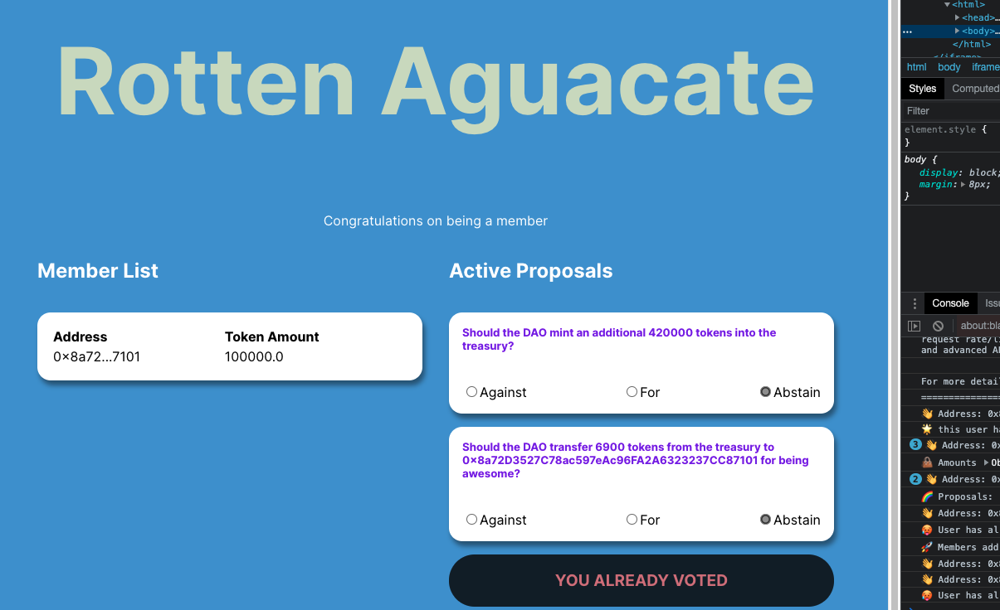

<h1> RottenAguacateDAO-</h1> 
<h2> Created for those who have suffered the loss of an Avocado</h2>

Connect your MetaMask and chose the testnet Rinkeby to mint your free NFT
 
<a href="https://rotten-aguacate.netlify.app/" target="blank_">
Rotten Aguacate

</a>

This was created with the buildspace Tutorial

# buildspace x thirdweb - Build your own DAO with just Javascript

